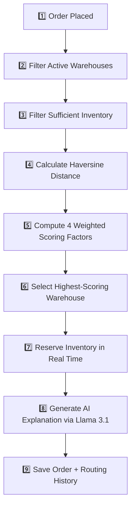

# 🚚 Order Routing Engine — AI-Powered Warehouse Selection

A full-stack logistics decision platform inspired by Amazon, Flipkart, and Blinkit. Place a customer order and the system **instantly selects the optimal warehouse** based on distance, inventory, delivery time, and cost — then generates an **AI-powered business explanation** of why that warehouse was chosen.

---

## 📑 Table of Contents

- [Overview](#-overview)
- [Key Features](#-key-features)
- [Tech Stack](#-tech-stack)
- [Project Structure](#-project-structure)
- [Prerequisites](#-prerequisites)
- [Installation & Setup](#-installation--setup)
- [Environment Variables](#-environment-variables)
- [Database Seeding](#-database-seeding)
- [Running the Application](#-running-the-application)
- [How the Routing Engine Works](#-how-the-routing-engine-works)
- [Weighted Scoring Formula](#-weighted-scoring-formula)
- [Authentication & Authorization](#-authentication--authorization)
- [User Roles & Permissions](#-user-roles--permissions)
- [API Reference](#-api-reference)
- [Database Models (Schemas)](#-database-models-schemas)
- [Frontend Architecture](#-frontend-architecture)
- [Frontend Pages](#-frontend-pages)
- [Auto-Order Generation (Cron)](#-auto-order-generation-cron)
- [Testing](#-testing)
- [Troubleshooting](#-troubleshooting)
- [License](#-license)

---

## 🔭 Overview

The **Order Routing Engine** is a full-stack web application that simulates a real-world order fulfillment pipeline. When a customer order is placed, the system:

1. **Filters** warehouses — eliminates inactive warehouses and those with insufficient inventory.
2. **Scores** remaining warehouses on four weighted factors (distance, inventory, delivery speed, and cost).
3. **Selects** the warehouse with the highest composite score.
4. **Reserves** inventory at the selected warehouse in real time.
5. **Generates** a natural-language AI explanation (via Groq/Llama 3.1) of the routing decision.
6. **Persists** the full decision history (all scores, eliminated warehouses, weights, AI explanation) for future auditing.

The platform also includes an interactive **Leaflet map** that draws polylines from the customer to the selected warehouse, a role-based **admin/manager dashboard**, and a configurable **routing weights panel**.

---

## ✨ Key Features

| Category | Feature |
|---|---|
| **Deterministic Routing** | Multi-factor weighted scoring prevents out-of-stock assignments and guarantees the best warehouse is always selected. |
| **AI Explanations** | Groq SDK + Llama 3.1 generate concise, business-friendly explanations for every routing decision. |
| **Interactive Mapping** | Leaflet / React-Leaflet visually draws polylines from customers to fulfillment centers with color-coded markers. |
| **Real-Time Inventory** | Inventory is reserved the exact moment an order is routed — no double-allocations. |
| **Role-Based Access** | JWT-authenticated users with `admin` and `manager` roles see different UI and have different API permissions. |
| **Configurable Weights** | Admin can tune the four scoring weights (distance, inventory, delivery, cost) via a dedicated settings page — weights must always sum to 100. |
| **Auto-Order Cron** | Optional `node-cron` job generates random orders every 30 seconds to simulate live traffic. |
| **Random Order Generator** | One-click button to generate and route a random order with a random Indian customer name, coordinates, product, and quantity. |
| **Full Audit History** | Every routing decision (all candidate scores, eliminated warehouses, config weights, AI explanation) is stored and browsable in the UI. |
| **Premium Dark UI** | Material UI dark theme with glassmorphism cards, backdrop blur, and vibrant purple/cyan accents. |

---

## 🛠️ Tech Stack

| Layer | Technology | Purpose |
|---|---|---|
| **Frontend** | React 19, Vite 8 | SPA framework and dev server |
| **UI Library** | Material UI (MUI) 9 | Dark-themed component library |
| **Icons** | Lucide React | Sidebar and dashboard icons |
| **Routing** | React Router DOM 7 | Client-side page routing |
| **HTTP Client** | Axios | API communication with interceptors |
| **Map** | Leaflet, React-Leaflet 5 | Interactive map with markers and polylines |
| **Backend** | Node.js, Express 5 | REST API server |
| **Database** | MongoDB Atlas, Mongoose 9 | Document storage and ODM |
| **Authentication** | JSON Web Tokens (JWT), bcryptjs | Token-based auth with password hashing |
| **AI** | Groq SDK (Llama 3.1 8B Instant) | Natural-language routing explanations |
| **Scheduling** | node-cron | Optional auto-order generation |
| **Testing** | mongodb-memory-server | In-memory MongoDB for integration tests |

---

## 📂 Project Structure

```
order-routing-engine/
│
├── README.md                       # This file
├── .gitignore                      # Git ignore rules
│
├── client/                         # ────── React Frontend (Vite) ──────
│   ├── index.html                  # HTML entry point
│   ├── package.json                # Frontend dependencies
│   ├── vite.config.js              # Vite configuration
│   ├── eslint.config.js            # ESLint configuration
│   ├── public/                     # Static assets (favicon, etc.)
│   └── src/
│       ├── main.jsx                # React DOM render entry
│       ├── App.jsx                 # Root component with routes
│       ├── App.css                 # Global styles
│       ├── index.css               # CSS reset / base
│       ├── theme.js                # MUI dark theme configuration
│       ├── api/
│       │   └── axios.js            # Axios instance with auth interceptors
│       ├── context/
│       │   └── AuthContext.jsx     # React Context for auth state
│       ├── components/
│       │   ├── Layout.jsx          # Sidebar + main content layout
│       │   └── ProtectedRoute.jsx  # Route guard (auth + role check)
│       └── pages/
│           ├── Login.jsx           # Login page
│           ├── Register.jsx        # Registration page
│           ├── Dashboard.jsx       # Admin dashboard (stats cards)
│           ├── WarehouseManagement.jsx  # CRUD for warehouses
│           ├── InventoryManagement.jsx  # View/update inventory
│           ├── OrderManagement.jsx      # Order list + route/generate
│           ├── RoutingDecision.jsx      # Decision details + map + scores
│           ├── RoutingHistory.jsx       # Historical routing log
│           ├── WarehouseMap.jsx         # Full warehouse map view
│           └── RoutingSettings.jsx      # Configure routing weights
│
└── server/                         # ────── Node.js Backend (Express) ──────
    ├── package.json                # Backend dependencies
    ├── server.js                   # Express app entry point
    ├── seed.js                     # Database seeding script
    ├── test_routes.js              # Integration test script
    ├── controllers/
    │   ├── authController.js       # Register & login logic
    │   ├── configController.js     # Get/update routing config
    │   ├── inventoryController.js  # CRUD inventory
    │   ├── orderController.js      # CRUD orders + random generation
    │   ├── productController.js    # CRUD products
    │   ├── routingController.js    # Route order + fetch history
    │   └── warehouseController.js  # CRUD warehouses
    ├── middleware/
    │   └── authMiddleware.js       # JWT verification + role guard
    ├── models/
    │   ├── Inventory.js            # Inventory schema
    │   ├── Order.js                # Order schema
    │   ├── Product.js              # Product schema
    │   ├── RoutingConfig.js        # Singleton routing weights
    │   ├── RoutingHistory.js       # Decision audit log
    │   ├── User.js                 # User schema with bcrypt hashing
    │   └── Warehouse.js            # Warehouse schema
    ├── routes/
    │   ├── authRoutes.js           # POST /register, /login
    │   ├── configRoutes.js         # GET/PUT /config
    │   ├── inventoryRoutes.js      # POST/GET/PUT /inventory
    │   ├── orderRoutes.js          # POST/GET/PUT /orders
    │   ├── productRoutes.js        # POST/GET /products
    │   ├── routingRoutes.js        # POST /route-order, GET /routing-history
    │   └── warehouseRoutes.js      # POST/GET/PUT /warehouses
    └── services/
        ├── routingEngine.js        # Core scoring algorithm (Haversine + weights)
        ├── aiExplanation.js        # Groq/Llama 3.1 prompt builder
        ├── orderService.js         # End-to-end order processing pipeline
        └── orderGenerator.js       # Random order generator for cron/manual
```

---

## 📋 Prerequisites

Before running the project, make sure you have:

| Requirement | Version | Notes |
|---|---|---|
| **Node.js** | ≥ 18.x | Required for both client and server |
| **npm** | ≥ 9.x | Comes bundled with Node.js |
| **MongoDB Atlas** | — | Free tier (M0) works. You need a connection URI. |
| **Groq API Key** | — | Free at [console.groq.com](https://console.groq.com). Used for AI explanations. Optional — the app works without it. |
| **Git** | Any | To clone the repository |

---

## 🚀 Installation & Setup

### 1. Clone the Repository

```bash
git clone https://github.com/your-username/order-routing-engine.git
cd order-routing-engine
```

### 2. Install Backend Dependencies

```bash
cd server
npm install
```

### 3. Install Frontend Dependencies

```bash
cd ../client
npm install
```

### 4. Configure Environment Variables

Create a `.env` file inside the `server/` directory (see the next section for all variables).

### 5. Seed the Database

```bash
cd server
node seed.js
```

### 6. Start the Backend

```bash
cd server
node server.js
```

> The server starts on `http://localhost:5000` by default.

### 7. Start the Frontend

Open a **new terminal**:

```bash
cd client
npm run dev
```

> The Vite dev server starts on `http://localhost:5173` by default.

---

## 🔑 Environment Variables

Create a `.env` file in the **`server/`** directory with the following keys:

```env
# Server port (defaults to 5000 if not set)
PORT=5000

# MongoDB Atlas connection string
MONGODB_URI=mongodb+srv://<username>:<password>@cluster.mongodb.net/order_routing

# Groq API key for AI explanations (optional — skipped gracefully if missing)
GROQ_API_KEY=gsk_your_groq_api_key_here

# JWT secret for signing tokens (falls back to 'fallback_secret_if_missing')
JWT_SECRET=your_jwt_secret_here

# Set to 'true' to enable the auto-order cron job (optional)
ENABLE_AUTO_ORDERS=false
```

The frontend uses a **Vite environment variable** to configure the API URL. It defaults to `http://localhost:5000/api`. To override it, create a `.env` file in the **`client/`** directory:

```env
VITE_API_URL=http://localhost:5000/api
```

---

## 🌱 Database Seeding

The `seed.js` script populates the database with sample data for immediate testing:

```bash
cd server
node seed.js
```

### What Gets Seeded

| Collection | Data |
|---|---|
| **Users** | `admin` / `admin123` (admin role), `manager` / `manager123` (manager role) |
| **Routing Config** | Default weights: Distance 35%, Inventory 35%, Delivery 20%, Cost 10% |
| **Warehouses** (5) | Mumbai Central Hub, Delhi NCR Depot, Bangalore Tech Park Storage, Chennai Coastal Warehouse, Hyderabad Logistics Center |
| **Products** (3) | Laptop (ELEC-LAP-001), Smartphone (ELEC-PHO-002), Headphones (ELEC-HDP-003) |
| **Inventory** (15) | One entry per warehouse × product, with random quantities (5–50). Some deliberately set low (2, 5, 8) to test low-stock indicators. |

> ⚠️ **Warning**: Running `seed.js` **deletes all existing data** (Warehouses, Products, Inventory, Orders, RoutingHistory, Users, RoutingConfig) before inserting fresh seed data.

---

## ▶️ Running the Application

### Development Mode (Recommended)

**Terminal 1 — Backend:**

```bash
cd server
node server.js
```

**Terminal 2 — Frontend:**

```bash
cd client
npm run dev
```

Open your browser at: **`http://localhost:5173`**

### Production Build (Frontend Only)

```bash
cd client
npm run build     # Outputs to client/dist/
npm run preview   # Serve the production build locally
```

---

## ⚙️ How the Routing Engine Works

When an order is submitted, it flows through a 6-step pipeline:



### Step-by-Step Breakdown

| Step | Description | Code Location |
|---|---|---|
| **1. Receive Order** | API receives `customerLat`, `customerLng`, `productId`, `quantity`, `customerName`. | `routingController.js` → `orderService.js` |
| **2. Query Inventory** | Find all inventory entries for the requested product, populating warehouse data. | `orderService.js` line 14 |
| **3. Eliminate Ineligible** | Remove warehouses that are inactive (`activeStatus !== true`) or have insufficient stock (`availableQuantity < quantity`). Record elimination reasons. | `routingEngine.js` lines 39–53 |
| **4. Haversine Distance** | Calculate the great-circle distance (km) between customer and each warehouse using the Haversine formula (Earth radius = 6,371 km). | `routingEngine.js` lines 3–14 |
| **5. Score Warehouses** | Compute four individual factor scores and combine them with configurable weights. | `routingEngine.js` lines 55–92 |
| **6. Select Best** | Pick the warehouse with the highest `finalScore`. | `routingEngine.js` lines 94–98 |
| **7. Reserve Inventory** | Decrement `availableQuantity` and increment `reservedQuantity` by the order quantity. | `orderService.js` lines 33–35 |
| **8. AI Explanation** | Send a structured prompt to Groq (Llama 3.1 8B Instant) with all metrics and rejected warehouses. Receive a 3-sentence business explanation. | `aiExplanation.js` |
| **9. Persist** | Create an `Order` document (status: `assigned`) and a `RoutingHistory` document with all scores, eliminated warehouses, weights, and AI text. | `orderService.js` lines 38–75 |

---

## 🧮 Weighted Scoring Formula

The final routing score for each warehouse is:

```
finalScore = (wDist × distScore) + (wInv × invScore) + (wDel × delScore) + (wCost × costScore)
```

Each factor is computed as follows:

| Factor | Default Weight | Formula | Description |
|---|---|---|---|
| **Distance** | 35% | `1 / (1 + distance_km)` | Inverse distance score via Haversine formula. Closer warehouses score higher. |
| **Inventory** | 35% | `availableQty / (availableQty + reservedQty)` | Ratio of available to total stock. Higher availability scores higher. |
| **Delivery** | 20% | `1 / ceil(distance_km / 200)` | Estimated delivery days assuming 200 km/day. Fewer days scores higher. |
| **Cost** | 10% | `1 / (1 + distance_km × 5)` | Shipping cost estimate at ₹5/km. Lower cost scores higher. |

> **Weights are configurable** via the Routing Settings page (admin only). They must always sum to exactly 100. The config is stored as a singleton document in the `RoutingConfig` collection.

---

## 🔐 Authentication & Authorization

### Authentication Flow

1. **Registration** — `POST /api/auth/register` creates a user with a hashed password (bcrypt, 10 salt rounds).
2. **Login** — `POST /api/auth/login` validates credentials and returns a signed JWT (8-hour expiry).
3. **Token Attachment** — The frontend Axios interceptor reads the token from `localStorage` and attaches it as a `Bearer` token on every request.
4. **Token Verification** — The `verifyToken` middleware decodes the JWT and injects `req.user` (with `id`, `username`, `role`).
5. **Auto-Logout** — The Axios response interceptor catches `401`/`403` errors, clears `localStorage`, and redirects to `/login`.

### Middleware

| Middleware | Purpose |
|---|---|
| `verifyToken` | Validates the JWT from the `Authorization: Bearer <token>` header. Rejects expired or invalid tokens. |
| `requireRole(...roles)` | Checks `req.user.role` against allowed roles. Returns `403 Forbidden` if the role is not permitted. |

---

## 👥 User Roles & Permissions

| Feature / Page | Admin | Manager |
|---|---|---|
| **Dashboard** (stats overview) | ✅ | ❌ |
| **Warehouse Management** (add/edit warehouses) | ✅ | ❌ |
| **Inventory Management** (view/update stock) | ✅ | ✅ |
| **Order Management** (view orders, mark fulfilled) | ✅ | ✅ |
| **Route an Order** (run routing engine) | ✅ | ❌ |
| **Generate Random Order** | ✅ | ❌ |
| **Routing Decision** (view decision details) | ✅ | ✅ |
| **Routing History** (browse past decisions) | ✅ | ✅ |
| **Warehouse Map** (interactive Leaflet map) | ✅ | ✅ |
| **Routing Settings** (configure weights) | ✅ | ❌ |
| **Create Products** | ✅ | ❌ |

### Default Credentials (from Seed)

| Role | Username | Password |
|---|---|---|
| Admin | `admin` | `admin123` |
| Manager | `manager` | `manager123` |

---

## 📡 API Reference

All endpoints are prefixed with `/api`. Most endpoints require a valid JWT token via the `Authorization: Bearer <token>` header.

### Authentication

| Method | Endpoint | Auth | Role | Description |
|---|---|---|---|---|
| `POST` | `/api/auth/register` | ❌ | — | Register a new user (username, password, role) |
| `POST` | `/api/auth/login` | ❌ | — | Login and receive a JWT token |

#### `POST /api/auth/register`

```json
// Request Body
{
  "username": "newuser",
  "password": "securepassword",
  "role": "admin"         // "admin" or "manager"
}

// Response (201)
{
  "success": true,
  "data": { "username": "newuser", "role": "admin" },
  "message": "User registered successfully"
}
```

#### `POST /api/auth/login`

```json
// Request Body
{
  "username": "admin",
  "password": "admin123",
  "role": "admin"
}

// Response (200)
{
  "success": true,
  "data": { "token": "eyJhbGciOi...", "username": "admin", "role": "admin" },
  "message": "Logged in successfully"
}
```

---

### Warehouses

| Method | Endpoint | Auth | Role | Description |
|---|---|---|---|---|
| `POST` | `/api/warehouses` | ✅ | Admin | Create a new warehouse |
| `GET` | `/api/warehouses` | ✅ | Any | List all warehouses |
| `GET` | `/api/warehouses/:id` | ✅ | Any | Get a specific warehouse by ID |
| `PUT` | `/api/warehouses/:id` | ✅ | Admin | Update a warehouse |

#### `POST /api/warehouses`

```json
// Request Body
{
  "warehouseName": "Kolkata Eastern Hub",
  "city": "Kolkata",
  "latitude": 22.5726,
  "longitude": 88.3639,
  "capacity": 7000,
  "activeStatus": true
}
```

---

### Products

| Method | Endpoint | Auth | Role | Description |
|---|---|---|---|---|
| `POST` | `/api/products` | ✅ | Admin | Create a new product |
| `GET` | `/api/products` | ✅ | Any | List all products |

#### `POST /api/products`

```json
{
  "productName": "Tablet",
  "category": "Electronics",
  "sku": "ELEC-TAB-004"
}
```

---

### Inventory

| Method | Endpoint | Auth | Role | Description |
|---|---|---|---|---|
| `POST` | `/api/inventory` | ✅ | Admin | Create inventory record |
| `GET` | `/api/inventory` | ✅ | Any | List all inventory (populated with warehouse & product names) |
| `PUT` | `/api/inventory/:id` | ✅ | Admin, Manager | Update inventory quantities |

#### `PUT /api/inventory/:id`

```json
{
  "availableQuantity": 100,
  "reservedQuantity": 5
}
```

---

### Orders

| Method | Endpoint | Auth | Role | Description |
|---|---|---|---|---|
| `POST` | `/api/orders` | ✅ | Admin | Create an order manually (without routing) |
| `POST` | `/api/orders/generate-random` | ✅ | Admin | Generate a random order and route it |
| `GET` | `/api/orders` | ✅ | Any | List all orders (populated with product & warehouse) |
| `GET` | `/api/orders/:id` | ✅ | Any | Get a specific order |
| `PUT` | `/api/orders/:id` | ✅ | Admin, Manager | Update order (e.g., mark as `fulfilled`) |

---

### Routing

| Method | Endpoint | Auth | Role | Description |
|---|---|---|---|---|
| `POST` | `/api/routing/route-order` | ✅ | Admin | Run the routing engine for an order |
| `GET` | `/api/routing/routing-history` | ✅ | Any | Get all routing history (sorted newest first) |
| `GET` | `/api/routing/routing-history/:orderId` | ✅ | Any | Get routing history for a specific order |

#### `POST /api/routing/route-order`

```json
// Request Body
{
  "customerLat": 18.5204,
  "customerLng": 73.8567,
  "productId": "64a1b2c3d4e5f6a7b8c9d0e1",
  "quantity": 2,
  "customerName": "Rahul Sharma"
}

// Response (200)
{
  "success": true,
  "message": "Order routed successfully",
  "data": {
    "order": { /* Order document */ },
    "selectedWarehouse": { /* Warehouse document */ },
    "routingScore": 0.8542,
    "routingReason": "Mumbai Central Hub was chosen because...",
    "allScores": [
      {
        "warehouseName": "Mumbai Central Hub",
        "distance_km": 123.45,
        "delivery_days": 1,
        "cost": 617.25,
        "distScore": 0.0080,
        "invScore": 0.9091,
        "delScore": 1.0,
        "costScore": 0.0016,
        "distWeighted": 0.0028,
        "invWeighted": 0.3182,
        "delWeighted": 0.2000,
        "costWeighted": 0.0002,
        "finalScore": 0.5212,
        "inventory": 50
      }
    ],
    "eliminatedWarehouses": [
      {
        "warehouseName": "Chennai Coastal Warehouse",
        "availableQuantity": 1,
        "reason": "Insufficient stock"
      }
    ],
    "weights": {
      "distanceWeight": 35,
      "inventoryWeight": 35,
      "deliveryWeight": 20,
      "costWeight": 10
    }
  }
}
```

---

### Routing Configuration

| Method | Endpoint | Auth | Role | Description |
|---|---|---|---|---|
| `GET` | `/api/config` | ✅ | Any | Get current routing weights |
| `PUT` | `/api/config` | ✅ | Admin | Update routing weights (must sum to 100) |

#### `PUT /api/config`

```json
// Request Body
{
  "distanceWeight": 40,
  "inventoryWeight": 30,
  "deliveryWeight": 20,
  "costWeight": 10
}

// Validation: sum must equal exactly 100
```

---

## 🗄️ Database Models (Schemas)

### User

| Field | Type | Required | Notes |
|---|---|---|---|
| `username` | String | ✅ | Unique |
| `password` | String | ✅ | Auto-hashed via bcrypt pre-save hook |
| `role` | String (enum) | ✅ | `"admin"` or `"manager"` |
| `createdAt` | Date | — | Defaults to `Date.now` |

### Warehouse

| Field | Type | Required | Notes |
|---|---|---|---|
| `warehouseName` | String | ✅ | e.g., "Mumbai Central Hub" |
| `city` | String | ✅ | e.g., "Mumbai" |
| `latitude` | Number | ✅ | GPS latitude |
| `longitude` | Number | ✅ | GPS longitude |
| `capacity` | Number | ✅ | Max storage capacity |
| `activeStatus` | Boolean | — | Defaults to `true`. Inactive warehouses are excluded from routing. |
| `createdAt` | Date | — | Defaults to `Date.now` |

### Product

| Field | Type | Required | Notes |
|---|---|---|---|
| `productName` | String | ✅ | e.g., "Laptop" |
| `category` | String | ✅ | e.g., "Electronics" |
| `sku` | String | ✅ | Unique SKU identifier (e.g., "ELEC-LAP-001") |
| `createdAt` | Date | — | Defaults to `Date.now` |

### Inventory

| Field | Type | Required | Notes |
|---|---|---|---|
| `warehouseId` | ObjectId → Warehouse | ✅ | Reference to the Warehouse |
| `productId` | ObjectId → Product | ✅ | Reference to the Product |
| `availableQuantity` | Number | ✅ | Available stock (decremented on routing) |
| `reservedQuantity` | Number | ✅ | Reserved stock (incremented on routing) |
| `updatedAt` | Date | — | Defaults to `Date.now` |

### Order

| Field | Type | Required | Notes |
|---|---|---|---|
| `customerName` | String | ✅ | e.g., "Rahul Sharma" |
| `customerLatitude` | Number | ✅ | Customer GPS latitude |
| `customerLongitude` | Number | ✅ | Customer GPS longitude |
| `productId` | ObjectId → Product | ✅ | Reference to the Product |
| `quantity` | Number | ✅ | Order quantity |
| `assignedWarehouseId` | ObjectId → Warehouse | — | Set by routing engine |
| `status` | String (enum) | — | `"pending"`, `"assigned"`, or `"fulfilled"` (default: `"pending"`) |
| `createdAt` | Date | — | Defaults to `Date.now` |

### RoutingConfig (Singleton)

| Field | Type | Required | Notes |
|---|---|---|---|
| `distanceWeight` | Number | ✅ | Default: 35 |
| `inventoryWeight` | Number | ✅ | Default: 35 |
| `deliveryWeight` | Number | ✅ | Default: 20 |
| `costWeight` | Number | ✅ | Default: 10 |
| `updatedBy` | ObjectId → User | — | Last admin who updated the config |
| `updatedAt` | Date | — | Defaults to `Date.now` |

### RoutingHistory

| Field | Type | Required | Notes |
|---|---|---|---|
| `orderId` | ObjectId → Order | ✅ | The order this decision belongs to |
| `warehouseId` | ObjectId → Warehouse | — | The selected warehouse |
| `routingScore` | Number | — | Final composite score of the winner |
| `routingReason` | String | — | AI-generated explanation text |
| `allScores` | Array (Mixed) | — | Full scoring data for all candidate warehouses |
| `eliminatedWarehouses` | Array (Mixed) | — | List of warehouses excluded and their reasons |
| `weights` | Mixed | — | Snapshot of the weights used for this decision |
| `createdAt` | Date | — | Defaults to `Date.now` |

---

## 🎨 Frontend Architecture

### Theme

The application uses a **custom MUI dark theme** defined in `client/src/theme.js`:

- **Background**: Near-black (`#0a0a0f`) with translucent paper surfaces
- **Primary color**: Vibrant purple (`#7c3aed`)
- **Secondary color**: Cyan (`#06b6d4`)
- **Cards**: Glassmorphism effect with `backdrop-filter: blur(10px)` and semi-transparent borders
- **Typography**: Inter font family
- **Buttons**: Rounded corners, no text transform

### State Management

- **AuthContext** — React Context manages user authentication state (`user`, `login()`, `logout()`). Persisted in `localStorage` under the key `auth_user`.

### API Layer

- **Axios instance** (`client/src/api/axios.js`) — Pre-configured with:
  - `baseURL` pointing to the backend
  - **Request interceptor**: Attaches JWT token from `localStorage`
  - **Response interceptor**: Auto-logout on `401`/`403` errors

### Route Protection

- **ProtectedRoute** component wraps pages that require authentication. It accepts an optional `allowedRoles` prop to restrict access by role.

### Layout

- **Persistent sidebar** (240px) with navigation links filtered by the logged-in user's role
- **Logout button** at the bottom of the sidebar
- **Main content area** renders the `<Outlet />` from React Router

---

## 📄 Frontend Pages

| Page | Route | Role | Description |
|---|---|---|---|
| **Login** | `/login` | Public | Username + password + role selection form |
| **Register** | `/register` | Public | User registration form |
| **Dashboard** | `/` | Admin | 4 stat cards: Total Warehouses, Total Products, Active Orders, Fulfilled Orders |
| **Warehouse Management** | `/warehouses` | Admin | Table of warehouses with add/edit functionality, active/inactive toggle |
| **Inventory Management** | `/inventory` | Admin, Manager | Table of inventory per warehouse × product, editable quantities, low-stock badges |
| **Order Management** | `/orders` | Admin, Manager | Table of all orders with status chips, "Route Order" form, "Generate Random" button |
| **Routing Decision** | `/routing-decision` or `/routing-decision/:orderId` | Admin, Manager | Detailed view: Leaflet map with polyline, AI explanation, scoring table, eliminated warehouses table |
| **Routing History** | `/routing-history` | Admin, Manager | Historical log of all routing decisions with expandable details |
| **Warehouse Map** | `/map` | Admin, Manager | Full-page Leaflet map showing all warehouse locations |
| **Routing Settings** | `/routing-settings` | Admin | Slider/input controls for the four scoring weights (must sum to 100) |

---

## ⏰ Auto-Order Generation (Cron)

The server supports **automatic order generation** using `node-cron`. When enabled, a random order is generated and routed every **30 seconds**.

### Enabling

Set the environment variable in `server/.env`:

```env
ENABLE_AUTO_ORDERS=true
```

### How It Works

1. A cron job runs every 30 seconds (`*/30 * * * * *`).
2. It picks a random customer name from a preset list (e.g., "Rahul Sharma", "Priya Patel") and appends a 3-digit number.
3. Random latitude/longitude within India (lat: 8.4–37.6, lng: 68.7–97.25).
4. Picks a random product and quantity (1–5).
5. Runs the full routing pipeline (same as a manual order).
6. Logs the result to the console.

### Manual Random Order

You can also trigger a single random order via the API:

```bash
POST /api/orders/generate-random
Authorization: Bearer <admin_token>
```

Or click the **"Generate Random Order"** button on the Orders page in the frontend.

---

## 🧪 Testing

### Integration Tests

The project includes an integration test script at `server/test_routes.js` that uses `mongodb-memory-server` to run tests against an in-memory MongoDB instance.

```bash
cd server
node test_routes.js
```

### What the Tests Cover

1. **Database Setup** — Connects to an in-memory MongoDB instance.
2. **Seed Test Data** — Creates 2 warehouses (Mumbai, Delhi), 1 product (Laptop), and inventory entries.
3. **GET /api/warehouses** — Verifies warehouse listing returns the correct count.
4. **POST /api/routing/route-order** — Sends an order from Pune (closer to Mumbai) and verifies:
   - The routing succeeds (`success: true`)
   - A warehouse is selected
   - All scores and eliminated warehouses are returned
5. **Teardown** — Disconnects and stops the in-memory server.

### Manual API Testing

You can test any endpoint using **cURL**, **Postman**, or **Thunder Client**:

```bash
# 1. Login to get a token
curl -X POST http://localhost:5000/api/auth/login \
  -H "Content-Type: application/json" \
  -d '{"username":"admin","password":"admin123","role":"admin"}'

# 2. Use the token for authenticated requests
curl http://localhost:5000/api/warehouses \
  -H "Authorization: Bearer <your_token>"

# 3. Route an order
curl -X POST http://localhost:5000/api/routing/route-order \
  -H "Content-Type: application/json" \
  -H "Authorization: Bearer <your_token>" \
  -d '{
    "customerLat": 18.5204,
    "customerLng": 73.8567,
    "productId": "<product_id>",
    "quantity": 1,
    "customerName": "Test User"
  }'
```

---

## 🔧 Troubleshooting

| Problem | Solution |
|---|---|
| **`Failed to connect to MongoDB`** | Verify your `MONGODB_URI` in `.env`. Ensure your IP is whitelisted in MongoDB Atlas (Network Access → Add IP). |
| **`AI explanation skipped because GROQ_API_KEY is not set`** | This is expected if you haven't set `GROQ_API_KEY`. The app still works — it just skips AI explanations. |
| **`Token expired` or auto-logout** | JWT tokens expire after 8 hours. Log in again. |
| **CORS errors** | The backend uses `cors()` with default settings (allows all origins). If deploying, configure specific origins. |
| **`No eligible warehouses with sufficient stock found`** | The requested quantity exceeds available stock in all active warehouses. Re-seed the database or update inventory. |
| **Leaflet map tiles not loading** | Ensure you have internet access. Tiles are loaded from OpenStreetMap CDN. |
| **Vite dev server can't connect to backend** | Ensure the backend is running on port 5000. Check `VITE_API_URL` in `client/.env`. |
| **`MongoServerSelectionError: connection timed out`** | Increase `serverSelectionTimeoutMS` in `server.js`, or check MongoDB Atlas cluster status. |

---

## 📜 License

This project is licensed under the **ISC License**.

---

<p align="center">
  Built with ❤️ using React, Express, MongoDB, and Groq AI
</p>
